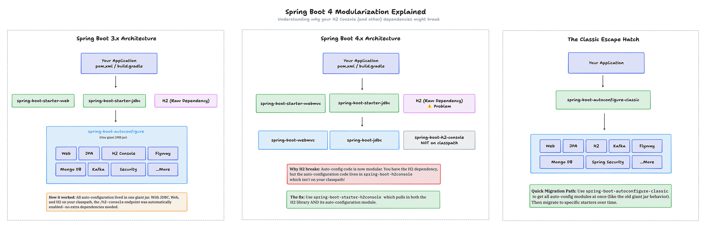

# Modularization of Spring Boot

Spring Boot 4 splits the monolithic `spring-boot-autoconfigure` JAR into focused modules. This reduces footprint but
changes how dependencies resolve during migration.

## Overview

Older Boot versions shipped all auto-configuration in one large artifact. Boot 4 only activates the auto-configs for
modules you explicitly include, which means some features will disappear until you add their module or starter.

## Key Concepts

- **Breaking change**: Libraries on the classpath no longer guarantee auto-configuration
- **Smaller footprint**: Only include modules you use
- **Explicit dependencies**: Clear ownership of features
- **Starter rename**: `spring-boot-starter-web` becomes `spring-boot-starter-webmvc`
- **Escape hatch**: `spring-boot-autoconfigure-classic` restores 3.x behavior

## Example

### H2 Console Missing After Upgrade
```xml
<!-- Boot 3.x: raw dependency worked with bundled auto-config -->
<dependency>
    <groupId>com.h2database</groupId>
    <artifactId>h2</artifactId>
    <scope>runtime</scope>
</dependency>

<!-- Boot 4.x: use the starter to get the auto-config module -->
<dependency>
    <groupId>org.springframework.boot</groupId>
    <artifactId>spring-boot-starter-h2-console</artifactId>
</dependency>
```

### Classic Compatibility
```xml
<dependency>
    <groupId>org.springframework.boot</groupId>
    <artifactId>spring-boot-autoconfigure-classic</artifactId>
</dependency>
```

## Architecture Comparison



### Boot 3.x (Monolith)
```
Your Application
    ├── spring-boot-starter-web
    ├── spring-boot-starter-jdbc
    └── h2
            │
            ▼
    spring-boot-autoconfigure (one giant JAR)
        └── Web, JPA, H2 Console, Flyway, Kafka, ...
```

### Boot 4.x (Modular)
```
Your Application
    ├── spring-boot-starter-webmvc
    ├── spring-boot-starter-jdbc
    └── h2
            │
            ▼
    spring-boot-webmvc
    spring-boot-jdbc
    spring-boot-h2-console (missing unless added)
```

## Common Migration Issues

| Missing Feature | Solution |
|-----------------|----------|
| H2 Console not working | Add `spring-boot-starter-h2-console` |
| RestClient not configured | Pick an HTTP client from start.spring.io |
| Flyway not running | Include Flyway starter | 
| Web starter renamed | Use `spring-boot-starter-webmvc` |

## Resources

- https://spring.io/blog/2025/10/28/modularizing-spring-boot
- https://github.com/spring-projects/spring-boot/wiki/Spring-Boot-4.0-Migration-Guide#module-dependencies
